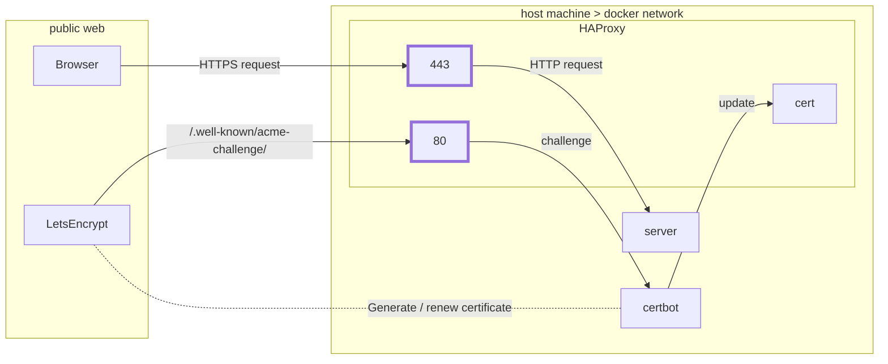

[Let's Encrypt](https://letsencrypt.org/) is a nonprofit [Certificate Authority](https://en.wikipedia.org/wiki/Certificate_authority) that provisions free TLS certificates to hundreds of millions of websites today. These certificates allow people to visit websites securely (i.e. over HTTPS). My [previous post](/blog/DIY_VPNs) on VPNs has some background on TLS certificates and why they're important for the web.

[certbot](https://certbot.eff.org/) is the recommended way of obtaining and renewing certificates from Let's Encrypt. It's a feature-rich, command-line tool with [extensive documentation](https://certbot.eff.org/docs/using.html). The main website has instructions for installing certbot on various OS-es and using with different software services (e.g. Apache, HAProxy, NGINX). [Many hosting providers](https://certbot.eff.org/hosting_providers) have full or partial support for HTTPS via Let's Encrypt. This post details a HAProxy configuration with certbot that ensures dynamic certificate reloads, no expected downtime, limited service exposure, and scheduled certificate renewals. This configuration can be used to secure any website or web service.

TLS certificates from Let's Encrypt have a 90-day lifespan after which they expire and must be "renewed". The website presents the [following 2 reasons as justification](https://letsencrypt.org/2015/11/09/why-90-days.html):

> (1) They limit damage from key compromise and mis-issuance. Stolen keys and mis-issued certificates are valid for a shorter period of time

---
> (2) They encourage automation, which is absolutely essential for ease-of-use. If we’re going to move the entire Web to HTTPS, we can’t continue to expect system administrators to manually handle renewals. Once issuance and renewal are automated, shorter lifetimes won’t be any less convenient than longer ones.

Both compelling reasons, but as the 2nd point suggests, systems *must* be configured and automated in such a way to accomodate issuance and renewal timelines. Not all systems are designed this way from the outset (e.g. they can't be updated on-the-fly once a certificate is renewed). Therefore, time is needed to modify the system or build new processes around it to achieve the desired functionality.

[HAProxy](https://www.haproxy.com/) is my go-to API gateway. I frequently use it to load-balance web traffic across multiple backend servers. Even when I don't need load-balancing, it's still useful as a reverse proxy (e.g. for rate-limiting web requests). Typically, I use HAProxy to perform TLS termination: it handles *HTTPS* traffic and forwards respective *HTTP* requests to backend servers. This way, I don't have to manage multiple TLS certificates if I have multiple backend servers. Plus, HTTP web services are easier to develop and test locally than HTTPS services.

The HAProxy configuration file optionally specifies [a path to a file containing a TLS certificate and private key](https://www.haproxy.com/blog/haproxy-ssl-termination/). This directive enables TLS and, as a result, HTTPS on the API gateway. To update the certificate after renewal, one might change the config file (if the new certificate has a different filename) and restart HAProxy. The [certbot instructions for HAProxy](https://certbot.eff.org/lets-encrypt/ubuntufocal-haproxy) mention pre and post-renewal hooks to stop and start before and after certificate renewal, respectively.

This approach has a clear downside: service downtime. After the service owner renews their TLS certificate, HAProxy must be stopped for a short period of time. In many cases, a few seconds or even a minute of downtime is tolerable, at least during off-peak hours. However, a no-downtime approach is prefereable even in cases where scheduled downtime is acceptable.

Fortunately, HAProxy has a [Runtime API allowing for dynamic configuration](https://www.haproxy.com/blog/dynamic-configuration-haproxy-runtime-api/). Even better, the Runtime API can be leveraged to [update TLS certificates without a service restart](https://www.haproxy.com/blog/dynamic-ssl-certificate-storage-in-haproxy/)! We could write shell scripts to generate and renew TLS certificates via certbot and then make the appropriate Runtime API calls to update HAProxy without introducing downtime.

This design improves upon the initial approach, but we can improve upon it further. Containerizing with [Docker](https://docs.docker.com/get-started/overview/) allows other developers to run our application even if they have different host OS-es. This is helpful since installation and usage instructions for certbot and HAProxy vary across systems. We can define the components in a [Docker Compose](https://docs.docker.com/compose/) file so other developers can easily spin up and tear down the entire application infrastructure. In addition, this approach creates a system with network isolation and selective service exposure. Take the following figure:

Note that port 80 and 443 are emboldened. indicating that HAProxy is the only containerized service open to the public web. HAProxy listens for HTTP requests on port 80 and HTTPS requests on port 443.

Why is HTTP enabled when our goal is to obtain TLS certificates for HTTPS? Well, certbot needs a way to prove to Let's Encrypt that we are in fact the owner of the domain in question before Let's Encrypt issues the certificate. Since we don't have a valid TLS certificate yet, we can't run an HTTPS server without triggering errors or security warnings on the client-side (e.g. "server has a self-signed certificate"). Therefore, Let's Encrypt must send (unencrypted) HTTP requests to us in order to validate our ownership *or* use another validation method (e.g. DNS, not covered in this post).

When HAProxy receives an HTTP request with method `GET` and path beginning with `/.well-known/acme-challenge/`, it forwards the request to certbot. Certbot handles the request and completes a challenge that proves we are the owner of the domain. Let's Encrypt then issues the certificate and certbot updates HAProxy via the Runtime API.

HTTP requests targeting other URL paths are redirected to HTTPS. HTTPS traffic is forwarded to our web server as HTTP. It doesn't really matter what the web server does, so long as there's a Docker image for it and it has an active HTTP listener. This enables a modular architecture where developers can "plug in" any web service they want and substitute others in later. They can even run the application infrastructure on multiple VPS-es, in front of different web services.

How do HAProxy, certbot, and the web server communicate with each other? Assuming they're located on the same [Docker bridge network](https://docs.docker.com/network/bridge/), they can refer to each other by DNS names (i.e. `<network>_<container>_<number>`). The documentation clearly describes how bridge networks offer inter-container connectivity while ensuring isolation from other processes on the host machine:

> In terms of Docker, a bridge network uses a software bridge which allows containers connected to the same bridge network to communicate, while providing isolation from containers which are not connected to that bridge network. The Docker bridge driver automatically installs rules in the host machine so that containers on different bridge networks cannot communicate directly with each other.

As mentioned before, HAProxy is the only service exposed to the world. That is, HAProxy has the only container with [published ports, a.k.a. ports mapped to host machine ports](https://docs.docker.com/config/containers/container-networking/#published-ports). Keep in mind that firewall rules must permit web traffic on the canonical ports (80 and 443). Any requests or responses for certbot or the web server go through HAProxy first. This addresses the availability, reliability, and security concerns of exposing certbot and our web server *directly* to the public web.

Things are looking pretty good. We're able to run certbot and dynamically update HAProxy with a valid TLS certificate. Three months pass and it's time to renew our certificate... what do we do? The original certbot container is no longer running. Unlike HAProxy or the web server, certbot is *not* daemonized. It performs a single operation (i.e. generates the certificate) and then exits. Yes, there are ways to keep the container alive such as `tail -f /dev/null`. However, this is typically a code smell indicating ones approach probably isn't the best option.

Ideally, we'd run another certbot container that would renew the certificate before its expiration date and then, like its predecessor, terminate. Rinse and repeat, every 3 months. This sounds like a task well-suited for [cron](https://man7.org/linux/man-pages/man8/cron.8.html). We can specify a monthly, or perhaps weekly, cron job that runs a certbot container on our Docker bridge network to check for certificate renewals. In the unlikely case that renewal attempts fail, a subsequent attempt would (hopefully) succeed before the expiration date.

Certbot has a [deploy hook](https://certbot.eff.org/docs/using.html?highlight=hook#renewing-certificates), which can be specified on the command line or in the filesystem, that *only* executes after a successful renewal attempt. If the cron job runs certbot and no certificate's renewed, there's no need to update HAProxy. This option allows us to dynamically reload HAProxy only when it needs to be updated.

So we have dynamic certificate reloads, no expected downtime, limited service exposure, and scheduled certificate renewals. All automated! Plus, it should work cross-platform so long as Docker and Compose are installed. Pretty cool no doubt, but this is just a high-level overview. I haven't shown you the config files, dug through shell scripts, or spelled out other implementation details. If you'd like to see the source though, you can check it out [here](https://github.com/zbo14/tls-refresh)! If you have your own thoughts about implementation, please share and/or contribute to the project!

Let's Encrypt and the [Internet Security Research Group (ISRG)](https://www.abetterinternet.org/) are doing really important work to improve web security. They're providing an invaluable service, allowing millions of people the secure their websites and web services for free. They have exposed APIs and built tooling to facilitate efficient certificate issuance and renewal automation.

But there is still room for improvement! I say this in the least pessimistic way possible. Enabling HTTPS everywhere and, more broadly, securing the web are serious undertakings. All of us with some online presence are part of the web, so any tectonic shift inevitably requires us to move with it. All the great work happening, that has happened, and that will happen in the space, give me hope and motivation. I think there's even more that can be done to make the shift less frustrating for all of us :)
